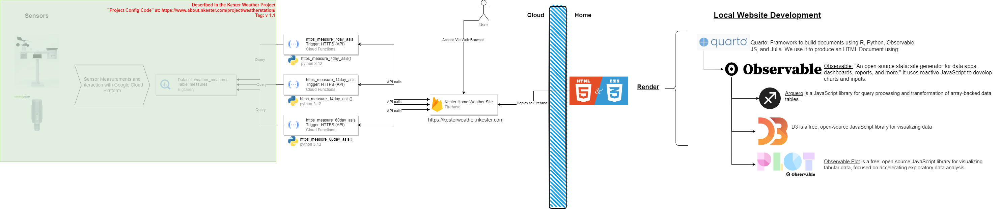

# Kester Weather Visualization Site

This is a companion project to my `The Kester Weather Station` project. While that project describes and documents how my son and I configured our home weather station, this project documents how we are interacting with, visualizing, and distributing the data the station collects.  

Links to all projects are below:  

  * `The Kester Weather Station`  
    * Private: https://gitlab.com/nkester-projects/2023_kesterkids_weatherstation/the_kester_weather_station  
    * Public: https://github.com/nkester/Kester-Weather-Station  
    
  * `Kester Weather Visualization Site`  
    * Private: https://gitlab.com/nkester-projects/2023_kesterkids_weatherstation/kester-weather-visualization-site  
    * Public: https://github.com/nkester/Kester-Weather-Visualization-Site  

> Visit the webpage at: https://www.kesterweather.nkester.com/

## This Project's Structure  

Through this project I will document and demonstrate the technical steps we took and the design decisions we made to create and deploy the site. Reference the table of contents below to jump to specific sections.  

  1. [Technical Decisions](#technical-decisions)  
  2. [Architecture](#architecture)  
  3. [Getting Data](#getting-data)  
  4. [Charting with Observable JS](#charting-with-observable-js)  
  5. [Publishing to Google Firebase](#publishing-to-google-firebase)

This site is deployed to Google Cloud Platform's Firebase hosting and is served at the following URL: https://www.kesterweather.nkester.com/ 

## Techical Decisions  

As an initial proof of concept, we decided to build a simple website locally using Quarto (https://quarto.org/), the next evolution of RMarkdown (https://rmarkdown.rstudio.com/), and host it on Google Cloud Platform's (GCP) Firebase Hosting platform. We took this approach for several reasons.  

**First**, Quarto notebooks now support using `R`, `python`, `Julia`, and `Observable JS` interchangeably. This allows us to use languages we are familiar with while extending that knowledge into new capabilities better suited for interactive charting on our webpage. To minimize cost, I don't want to build a full application that requires a server like an `R Shiny` (https://shiny.posit.co/) or a `Python Flask` (https://flask.palletsprojects.com/en/3.0.x/) application. `Observable JS` (https://observablehq.com/) or `ojs` provides that in-browser interactive functionality in a static HTML document. This allows us to write all of the database querying functions and data manipulation in `R`, which I'm most familiar with, and then pass that to `ojs` for user reactive data manipulation and charting.  

**Second**, we decided to build the website locally to start so we would not need to solve the complexities of providing near real time data from our home weather station to our deployed webpage. That will come in the future, but not yet.  

**Third**, we decided to use Google's Firebase Hosting platform to host the webpage because it is familiar to us and because we intend to use GCP services to support future builds of the project.  

## Architecture

Due to the technical decisions described above, the following are the tools and their interactions we used to implement those decisions. Each tool serves a different purpose and each are described in the following steps.  

All code is contained in the Quarto Markdown Document called [WeatherMeasurements.qmd](R/WeatherMeasurements.qmd). In the following sections of thie "readme" I'll refer to sections by their "Chunk Name" located at the top of each code chunk.

  

Functions:  
[Getting Data](#getting-data)  
[Charting](#charting-with-observable-js)  
[Publishing](#publishing-to-google-firebase)

## Getting Data  

In this initial architecture, all measurement data is stored in a PostgreSQL database on my local home network. For that reason, in order to get to the data I'll need to connect to the database and extract all required data while on my home network. I'll use `R` to perform these operations.  

All code referenced in this section is contained in the code chunks: `{r functions}` and `{r getData}`. 

The `{r functions}` chunk defines two functions used in this part of the process: `agg_query` and `measure_gather`.  I will describe these functions as they are implemented.  

The `{r getData}` chunk is what is executed by `R` at "Render time." I'll walk through this check in order. First, a boolean variable called `update` is defined in chunk `{r setup}` at the top of the document. This determines if the script should get new data from the database or just perform the basic transformation functions of existing data in order to pass it on to the `{ojs}` chunks.  

### Preparing to Get Data

If `update` is defined as `TRUE`, we start by loading the connection information which is stored in an `.RData` file, not included in the source code. It simply defines the five variables required to connect to the database: `db` = the database name, `host` = the database IP address, `port` = the database port, `user` = the database user name, and `password` = the user's password.  

Next, we define a tibble named `measure_spec` that lists the PostgreSQL function we want to use to aggregate each of the measures we collect. This is important because as we combine the measurements for `Air Temperature` over an hour, day, or month, it makes sense to take an average of the measurements rather than the sum. Conversley, when aggregating the measurements for `Rain Guage` it makes more sense to take the sum than the average. We will use this table later to build measurement specific queries in the `agg_query` function.  

This table looks like:  

```
> measure_spec
# A tibble: 8 × 2
  fun   type                 
  <chr> <chr>                
1 avg   Air Humidity         
2 avg   Air Temperature      
3 avg   Barometric Pressure  
4 avg   Light Intensity      
5 sum   Rain Gauge           
6 avg   UV Index             
7 avg   Wind Direction Sensor
8 avg   Wind Speed 
```

Next I define the levels of aggregation I want to build data for, defined as a character vector: `agg_levels`. For now, those levels are: `As Measured`, `month`, `day`, and `hour`.  

Finally, we build a tibble with the proper column names and column data types for the `measure_tib` table. Later we will fill this table with data using the `measure_gather` function and then store that in an `RDS` file and pass the data to `{ojs}` for display and interactivity.  

The `measure_tib` table structure looks like:

```
> dplyr::glimpse(measure_tib)
Rows: 0
Columns: 6
$ aggregate_level <chr> 
$ date            <dttm> 
$ type            <chr> 
$ measure         <dbl> 
$ measure_min     <dbl> 
$ measure_max     <dbl> 
```

This completes the preparations for data collection. In the next step we will connect to the database and pull in data.  

### Extracting, Transforming, and Loading Data  

First, we connect to the database using `R`'s standard `DBI` database connection function with the `RPostgreSQL` connection driver and the connection information previously mentioned.  

We then pass that connection object, `con` to the `measure_gather` function along with the `measure_spec`, `measure_tib`, and `agg_levels` previously described.

The `measure_gather` function fills the empty `measure_tib` table iteratively for each measure in the `measure_spec` table and by each aggregation level in the `agg_levels` vector.  

As it iterates through these options, it builds a specific PostgreSQL database query using the `agg_query` function which I'll describe shortly in the `agg_query` section below. It sends that query string to the database which returns a table with the structure described previously by the `measure_tib` table. It then binds that table's rows to those existing in the `measure_tib` table and continues the iteration until all are complete.  

Finally, the function returns the `measure_tib` tibble and the script saves that response as an `RDS` file which takes less disk space than a flat file (e.g. csv) and retains the data types.  Below is a description of the `agg_query` function. 

#### `agg_query`

The `agg_query` function takes three arguments: `agg_function`, `type`, and `agg_level`.  

Throughout this function we use `R`'s `sprintf()` function to pass character variables into a string using the `%s` key to build these queries. The variable value replaces these `%s` keys in the order they appear.

When the aggregation level is `As Measured` the query is more basic and simply selects from the PostgreSQL `sensor_data` view the columns `time`, `type`, and `measurementValue`. We only select the rows in the view where the `type` is the same as the `type` requested in the `agg_query` function call. Likewise, because there is no aggregation, we record the `measurementValue` as the same for the `measure`, `measure_min`, and `measure_max` fields. A fully formed version of this query looks like:  

```
SELECT time AS date,
       type, 
       \"measurementValue\" AS measure, 
       \"measurementValue\" AS measure_min,
       \"measurementValue\" AS measure_max 
FROM sensor_data 
WHERE type = 'Air Temperature'
```

If the aggregation level is not `As Measured` we perform a multiple step query.  

The first step is to truncate the date (`time` column in the PostgreSQL `sensor_data` view) according to the indicated aggregation level (`month`, `day`, `hour`) and return it as the `date` column along with the `type` and `measurementValue` columns.  

From that table we group the rows by common `date` and `type` which will make groups by either hour, day, or month depending on the previous step. We will collapse all observations in those groups to a single line using a set of PostgreSQL aggregation functions. Common to all is taking the `min` and `max` measurement in the group. Then we use the specific PostgreSQL aggregation function provided as the `agg_function` function argument for the specific measure we're looking at. This is either `avg` for the average or `sum` for the sum.  

> There is an error in this logic. Calling the `min` and `max` for measurements take every 15 minutes makes sense when the specific measurement aggregation function used is the average but this does not make sense when that function is the sum. These columns are meaningless in that case.

Finally, from those groups we'll select the `date` and `type` column as is.

The function then returns, as a string, the fully constructed PostgreSQL query.

#### Loding the data  

Regardless of seting the `update` variable to `TRUE` or `FALSE`, the script looks for the existance of the `weatherData.RDS` file which is the output of the previous script. If it exists, it loads it.  

The script then checks if the object `measure_tib` exists in memory. This should be the case if a properly formed `weatherData.RDS` obejct is found. This check protects against failing due to an error in that file.  

If the `measure_tib` exists, R passes that to Observable JS (`ojs`) as the object `measures` which we will interact with in the next section.

## Charting with Observable JS  

To help charting and data manipulation in `ojs` we will use the `{arquero}` and `{d3}` packages. Arquero is an `{ojs}` package for data manipulation modeled after `R`'s `{dplyr}`. Also, in the conversion from `R` to `ojs`, the date-time field has reverted back to a text string so I'll use the `{d3}` package to build a parser to convert the text back into an appropriate date-time data type.  

Finally, another data transformation task I have to deal with is the shape of the data. `R` handles data as rectangular while `ojs` handles it as a set of arrays. If I leave it as is, we will get an `e is not iterable` error. To overcome this we simple need to transpose the data sent from `R`.  

> Many of the solutions I implement here were discovered from this Stack Overflow post [Passing Dates from R to OJS](https://stackoverflow.com/questions/76499928/passing-dates-from-r-chunk-to-ojs-chunk-using-ojs-define-in-quarto)  

To start, we import all `ojs` depenedences and define the data-time parser in the `ojs imports` code chunk.  

Next, in the `ojs filterData` code chunk, we use the `{arquero}` `from` method to transpose the `measures` dataset and then derive a new format for the `date` column using the `{d3}` parser defined in the `ojs imports` code chunk.  

Finally, we create a new variable called `filteredData` based on input devices that allow the user to select the measure and time aggregation they want to see. The `.filter` method tells `ojs` to include data whose `type` column includes the user's selected `measure_type` (referred to as `m`) and whose `aggregate_level` column includes the user's selected `time_aggregation` (referred to as `t`).  

> I found a great deal of help in developing this approach from the this guide in the [Quarto Example Page](https://quarto.org/docs/interactive/ojs/examples/arquero.html) 

This filtered data is then used in the charts and tables displayed on the web page.  

A few things to note about `ojs`. First, all data manipulation and data rendering (charts) happens within the user's browser. This means that each user has an independent session and no server is required to power these manipulations like in `R Shiny`. Second, `ojs` does not run in order like `R` or `Python`. For this reason, we can put all support, data transformation, etc. cells at the end of the notebook in a consolidated section. This is often called the "Appendix". 

Now that we have our data and the hooks to filter our data based on user input, we move up to build those inputs in the `ojs inputs` code chunk. Here I was lazy and hard coded the list of options I wanted to user to be able to select. This will change in future iterations. We create an input element by declaring `viewof` the input variable name (what will refer to it by in code), and `Inputs.select`. We do this for the `time_aggregation` and `measure_type` variables we mentioned previously.  

Next, Quarto provides this great option to create tabsets within the webpage which are titled by the octothorp headers (`##`). Every header between the three colons becomes a tab and all text and code between those headers go into that tab. So, we create one tab for plots and another for the raw data table.  

With that, that is all we need to do to execute basic charting using `ojs`!

## Publishing to Google Firebase

Google Firebase is a simple and free website hosting solution. Access the Google Firebase Web Console at this [website](https://console.firebase.google.com).  

In order to keep all resources I plan to use in the future separate from others, I'll create a specific project for this called `Weather Station`. Once that is done, I'll select `Hosting` and it should provide instructions on what steps to take. Generally, you should install the `firebase` command line interface (CLI) tool. There are various ways to do this but the one I chose was by using `npm` like this: `sudo npm install -g firebase-tools`.  

I authenticated into firebase with my google information using the following command: `firebase login --no-localhost`  

Login and authenticate. The `--no-localhost` flag is needed when running from a container.

Next, after navigating to the project folder in my development environment, initiate `firebase` with: `firebase init`  

Choose the option fo Firebase Hosting and select the project. Then provide the project directory the files are in. For me this was: `/config/workspace/kesterWeatherSite/site`.  Of note, I chose the `site` sub-directory so that I could place only my project artifacts (those files I want in my hosting environment) in that folder.  

Once you've made the changes you want, enter the command `firebase deploy` to update the website.  

That's it.

### Resources  

A list of resources I found useful are below. Some are referenced in the text above but not all.  

  * https://observablehq.com/plot/features/plots  
  * https://d3js.org/  
  * Data manipulation with Arquero [Quarto](https://quarto.org/docs/interactive/ojs/examples/arquero.html) 
  
  
How to conditionally show marks in a chart. I want to use this to turn on or off certain measures that make sense to be plotted together.  
`https://observablehq.com/@observablehq/plot-optional-marks?intent=fork`  

Passing date data from `R` to `OJS` converts it back to strings. This explains how to parse the data in `OJS`: https://stackoverflow.com/questions/76499928/passing-dates-from-r-chunk-to-ojs-chunk-using-ojs-define-in-quarto 

